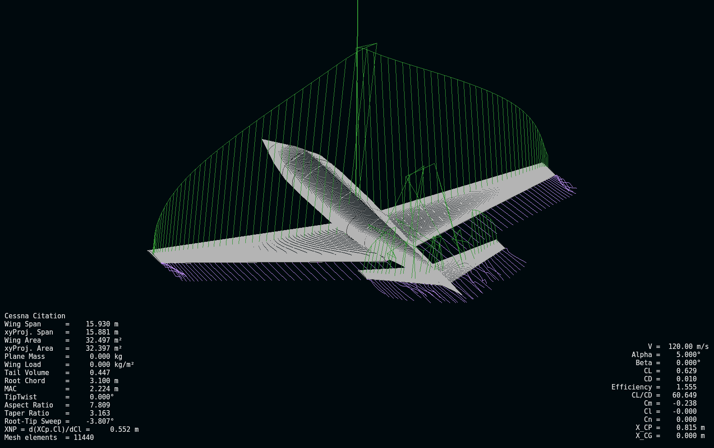

# SVV-Group-B37-TUDelft
Simulation code for the flight dynamics assignment part of the TUDelft AE SVV course. 

### Usage

- be sure to have a compiler that recognizes the types of imports as `src.input.parameters` ecc. 
- run `main.py` with a normal python compiler
